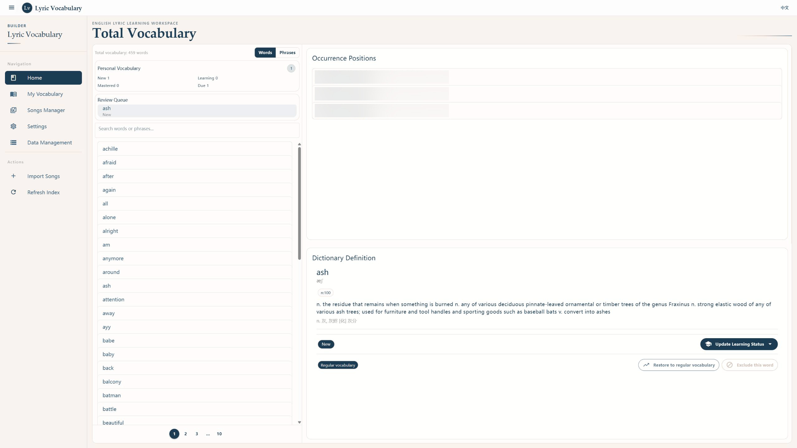
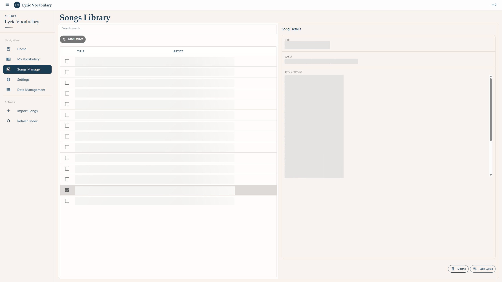
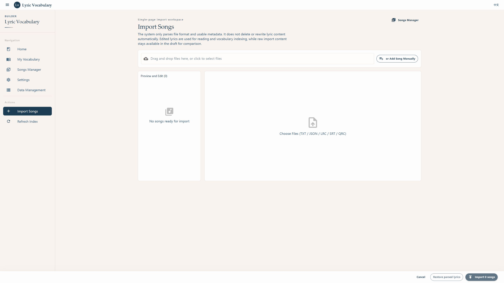
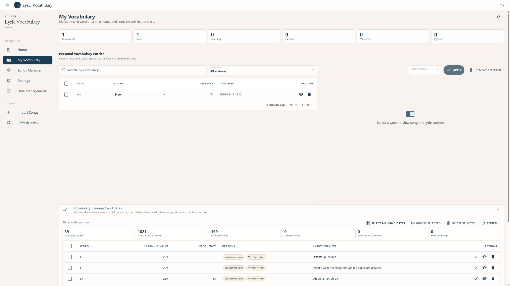
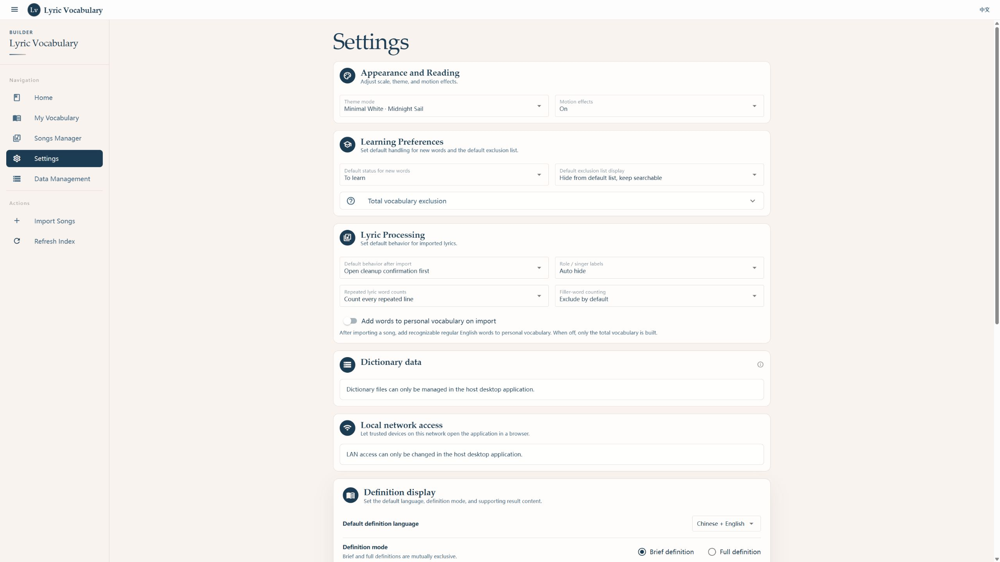
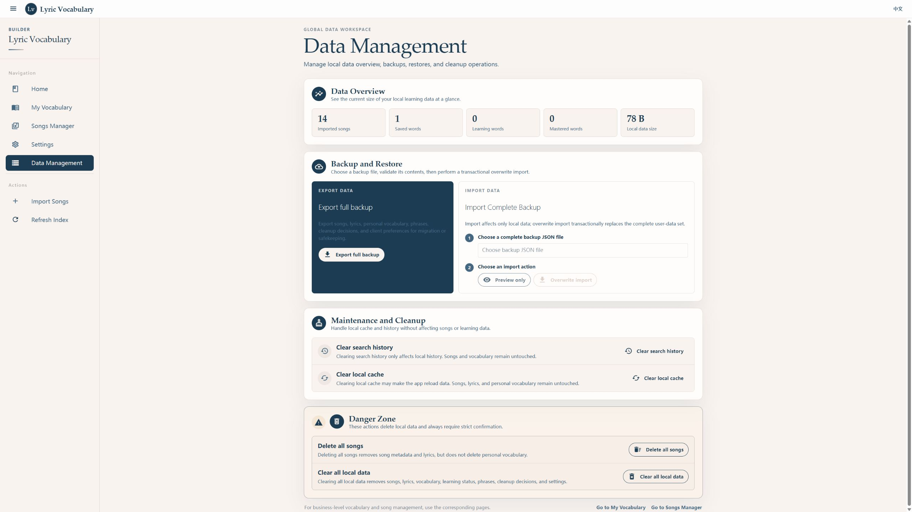

# Lyric Vocabulary Builder

[English](README.md) | [简体中文](README.zh-CN.md)

Lyric Vocabulary Builder is a local English vocabulary learning app for native Chinese speakers. It turns English lyrics that users are authorized to use into searchable, trackable, and reviewable learning material.

The app follows a focused learning loop: import lyrics, clean and structure them, look up words in their lyric context, review English definitions and Chinese explanations, then add useful words to a personal vocabulary list.

## Highlights

- **Structured lyric import**: Supports TXT, JSON, LRC, SRT, and manual paste, with a workflow designed for preparing learning material.
- **Recoverable cleaning results**: Keeps the original lyrics, normalized lyrics, line classifications, and user corrections so changes can be reviewed or restored.
- **Cross-song lemma search**: Forms such as `running`, `ran`, and `runs` can be grouped under `run`.
- **Learning in lyric context**: Words are learned in the real lyric lines where they appear instead of as isolated flashcards.
- **Optional external dictionary**: Dictionary data is supplied by the runtime environment. The main project does not bundle a dictionary and also works without one.
- **Personal vocabulary loop**: Add words, update learning status, record familiarity, view statistics, and review words that are due.
- **Chinese learner friendly**: The interface is designed around learning English through English songs for Chinese-speaking learners.

## Dictionary Data

Dictionary data is maintained and published separately by the [LyricVocabularyDictionary](https://github.com/EachYoungX/LyricVocabularyDictionary) project. It is not included in this repository or in the application installer.

Download and extract `dictionary.sqlite` from the [LyricVocabularyDictionary 1.0.0 release](https://github.com/EachYoungX/LyricVocabularyDictionary/releases/tag/1.0.0). In the desktop app, open **Settings → Dictionary Data**, open the default directory, move the file there, and click **Rescan**. You can also select a compatible dictionary file from another location. If an external file is moved or deleted, select or scan it again.

## Screenshots

The screenshots below use the local demo database in `backend/data/app_data.db`, which contains 14 songs, 459 vocabulary entries, and a personal vocabulary example. Each image was captured after the page finished rendering, asynchronous requests completed, and transient notices were cleared, using a 2560×1440 viewport.








## Application Flow

The learning flow is linear:

1. Import lyrics from TXT, JSON, LRC, SRT, or manual paste.
2. Normalize the lyric text while retaining both the original import and the learning-text version.
3. Review or edit the learning text without changing the first imported copy.
4. Tokenize lyric lines, normalize lemmas, and build a lemma-based vocabulary index.
5. Search words in their lyric context and view English definitions and Chinese explanations.
6. Add useful words to the personal vocabulary list and keep updating their learning status.

## Tech Stack

| Layer | Technology |
|---|---|
| Frontend | Vue 3, Quasar 2, TypeScript, Pinia, Vue Router, Axios |
| Backend | Java 25, Spring Boot 3.5, Spring Web, Spring Data JPA |
| Database | SQLite user database + optional external SQLite dictionary |
| API contract | OpenAPI 3.1, generated TypeScript client |
| Tooling | Maven Wrapper, pnpm, ESLint, Vite |

## Architecture

The system can be understood as four layers:

- Learners use the Vue and Quasar frontend to import songs, browse vocabulary, manage lyrics, and maintain personal learning status.
- The frontend calls the Spring Boot API through the OpenAPI-generated TypeScript client.
- The backend stores songs, structured lyric lines, vocabulary tokens, and personal learning records in a local SQLite user database.
- The vocabulary index builder creates searchable lemma entries from imported lyrics. Dictionary lookups are enabled only when an external SQLite dictionary is configured in the runtime environment; dictionary data is never packaged with the main project.

## Local Development

Requirements: Java 25, Node.js 20 or later, and pnpm 11. The repository includes the Maven Wrapper, so Maven does not need to be installed separately.

### Backend

```bash
cd backend
./mvnw spring-boot:run
```

The default API address is:

```text
http://localhost:8080
```

Development uses the local SQLite user database:

```text
backend/data/app_data.db
```

If the database does not exist, the backend initializes it from `schema.sql` and applies the required lightweight migrations.

The default mode runs without a dictionary. To use an external dictionary, set:

```text
APP_DICTIONARY_ENABLED=true
APP_DICTIONARY_DB_URL=jdbc:sqlite:/absolute/path/lyric-dictionary.sqlite
```

Without a dictionary, song import, lyric editing, vocabulary indexing, and personal vocabulary remain available. Definitions and dictionary-dependent phrase matches return empty or not-found results without reading dictionary tables. To explicitly run in dictionary-free mode:

```bash
APP_DICTIONARY_ENABLED=false ./mvnw spring-boot:run
```

### Frontend

```bash
cd frontend
pnpm install --frozen-lockfile
pnpm dev
```

Quasar prints the development address in the terminal, usually:

```text
http://localhost:9000
```

### Regenerate the Frontend API Client

The backend OpenAPI contract is stored at:

```text
backend/src/main/resources/api-docs.yaml
```

Generate the client with:

```powershell
cd frontend
pnpm gen-api
```

The generation script adapts the backend `{ code, message, data }` response envelope automatically.

Development connects to `http://localhost:8080` by default. Set `VITE_API_BASE_URL` when the API is hosted elsewhere. Production builds use same-origin `/api` by default, which works well behind a reverse proxy. For LAN development, add the exact frontend origin to `APP_CORS_ALLOWED_ORIGINS`, such as `http://192.168.1.20:9000`, and point the frontend at a LAN-reachable backend address.

## Verification

Backend:

```bash
cd backend
./mvnw clean test
```

Frontend:

```powershell
cd frontend
pnpm lint
pnpm test
pnpm build
```

## Deployment Notes

The project is intended for a local learning tool, a single-machine demo, or a small self-hosted deployment.

1. Build and run the backend:

```bash
cd backend
./mvnw clean package
java -jar target/backend-1.0.0.jar
```

2. Build the frontend:

```powershell
cd frontend
pnpm build
```

3. Deploy `frontend/dist/spa` as a static site and proxy API requests to the backend.

The default deployment scope is localhost or a trusted LAN. The backend has no user authentication or authorization, and CORS is not an authentication mechanism, so the API should not be exposed directly to the public internet. Use a trusted reverse proxy for authentication and TLS when a wider access scope is required. Keep `backend/data/app_data.db` out of the repository and do not publish imported lyrics or learning data; dictionary files are managed by the deployment environment and are not part of this project’s release artifacts.

## Backup and Restore

The Data Management page exports a versioned full backup containing song source data, structured lyrics and user corrections, contributors, personal vocabulary, user phrases, persistent vocabulary override rules, interface language, animation settings, and retained cleaning-candidate decisions. Before changing data, restore validates the full backup and performs an overwrite inside a transaction, then rebuilds derived vocabulary and phrase caches. Personal vocabulary CSV is a lightweight migration format containing only `lemma`, `status`, and `note`; use a full JSON backup when exact timestamps and learning states must round-trip.

## Data and Copyright Boundaries

- This repository does not contain or distribute a lyric library.
- Import only lyric text that you own or are authorized to process.
- The app is fully local. It does not upload local data or read unauthorized external files.
- Imported lyrics, cleaning results, vocabulary indexes, and personal learning status are stored in the local database.
- Dictionary source data and release packages are maintained by the separate [LyricVocabularyDictionary](https://github.com/EachYoungX/LyricVocabularyDictionary) project. This project does not include or distribute dictionary files. When configuring an external dictionary, verify its source, license, and usage rights.
- This project makes no warranty about the accuracy, completeness, authorization status, or suitability of external dictionary data.

## Repository Layout

```text
.
├── backend/                 # Spring Boot API
│   ├── src/main/java/       # domain code
│   ├── src/main/resources/  # schema, OpenAPI, runtime configuration (no dictionary)
│   └── data/                # local runtime database, ignored by git
├── frontend/                # Quasar Vue app
│   ├── src/components/
│   ├── src/pages/
│   ├── src/services/api/    # generated OpenAPI client
│   └── src/css/             # visual tokens and global styles
├── assets/screenshots/      # README screenshots
├── CHANGELOG.md             # completed and verified stage history
└── README.md                # default English README
```

The original 2ndLA word list, preliminary JSON curation, translation batches, and published phrase SQLite are maintained outside this repository. The dictionary project is released independently; this project connects to an external SQLite file through `APP_DICTIONARY_DB_URL`.

## Current Status

Stages 0 through 7 are complete and verified. See [CHANGELOG.md](CHANGELOG.md) for details.
