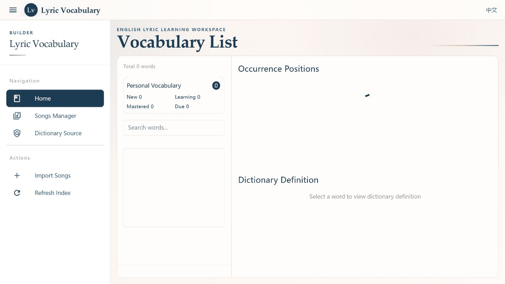
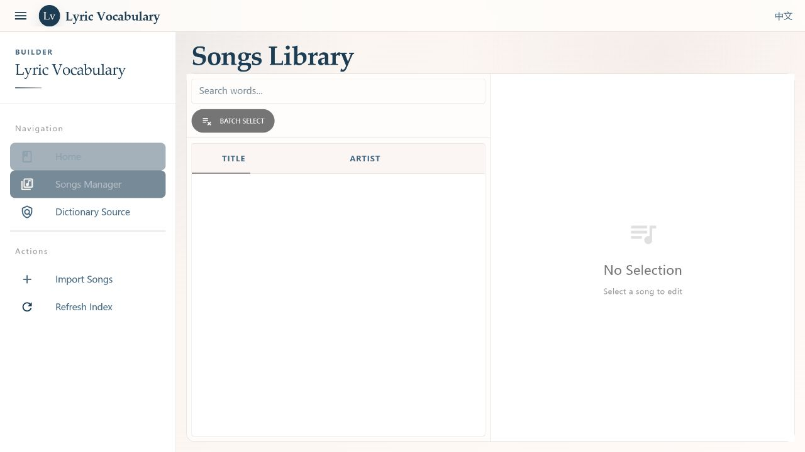

# Lyric Vocabulary Builder

[English](README.md) | [简体中文](README.zh-CN.md)

Lyric Vocabulary Builder is a local-first vocabulary learning app for Chinese-speaking English learners. It is not a lyrics player and does not ship a lyrics library. Instead, it turns user-provided English lyrics into structured, searchable, reviewable vocabulary study material.

The project focuses on one practical learning loop: import lyrics you are allowed to use, clean and structure them, search words in real lyric context, check bilingual dictionary entries, and track personal vocabulary status.

## Screenshots





## Highlights

- **Structured lyric import**: TXT, JSON, LRC, SRT, and manual paste workflows are designed for learning material preparation.
- **Recoverable cleanup**: the app keeps raw lyrics, normalized lyrics, line classification, and user corrections instead of silently deleting context.
- **Lemma-based search**: related forms such as `running`, `ran`, and `runs` can be grouped under `run`.
- **Vocabulary in context**: words are reviewed inside the lyric lines where they actually appear.
- **Offline dictionary integration**: local development keeps an ignored ECDICT SQLite copy; phrase releases are maintained separately.
- **Personal vocabulary loop**: learners can add words, update status, track familiarity, view stats, and review pending words.
- **Chinese learner friendly**: product copy, edge cases, and documentation are written around Chinese-native learners studying English through songs.

## What The App Does

The learning flow is intentionally linear:

1. Import lyrics from TXT, JSON, LRC, SRT, or manual paste.
2. Normalize the text and preserve both the raw import and the learning version.
3. Review or edit the learning text without destroying the original import.
4. Tokenize lyric lines, normalize word forms, and build a lemma-based vocabulary index.
5. Look up words in their real lyric context with bilingual dictionary support.
6. Add useful words to the personal vocabulary list and update learning status over time.

## Tech Stack

| Layer | Stack |
|---|---|
| Frontend | Vue 3, Quasar 2, TypeScript, Pinia, Vue Router, Axios |
| Backend | Java 25, Spring Boot 3.5, Spring Web, Spring Data JPA |
| Database | SQLite user database + local ECDICT SQLite dictionary |
| API Contract | OpenAPI 3.1, generated TypeScript client |
| Tooling | Maven Wrapper, pnpm, ESLint, Vite |

## Architecture

At a high level, the app is split into four parts:

- The learner uses a Vue and Quasar frontend for importing songs, browsing vocabulary, managing lyrics, and tracking personal word status.
- The frontend talks to a Spring Boot API through an OpenAPI-generated TypeScript client.
- The backend stores songs, structured lyric lines, tokenized vocabulary, and personal learning records in a local SQLite user database.
- Dictionary lookup reads the local ECDICT SQLite copy during development, while the vocabulary index builder derives searchable lemma entries from the user's imported lyrics. A release or external SQLite can override this path through configuration.

## Local Development

### Backend

```powershell
cd backend
.\mvnw.cmd spring-boot:run
```

Default API URL:

```text
http://localhost:8080
```

The development profile uses a local SQLite database:

```text
backend/data/app_data.db
```

If the database does not exist, the backend initializes it from `schema.sql` and applies the required lightweight migrations. Development reads `backend/src/main/resources/dictionary.sqlite`, which is ignored by Git and can be refreshed from the companion dictionary repository. The app also supports a no-dictionary profile.

Optional dictionary override:

```text
APP_DICTIONARY_ENABLED=true
APP_DICTIONARY_DB_URL=jdbc:sqlite:/absolute/path/lyric-dictionary.sqlite
```

For a no-dictionary build or local run:

```text
SPRING_PROFILES_ACTIVE=dev,no-dictionary
```

### Frontend

```powershell
cd frontend
pnpm install
pnpm dev
```

Quasar prints the dev URL in the terminal. It is usually:

```text
http://localhost:9000
```

### Generate The API Client

The backend OpenAPI contract lives at:

```text
backend/src/main/resources/api-docs.yaml
```

Generate the frontend client:

```powershell
cd frontend
pnpm gen-api
```

The post-generation script adapts the generated client to the backend response envelope.

## Verification

Backend:

```powershell
cd backend
.\mvnw.cmd clean test
```

Frontend:

```powershell
cd frontend
pnpm lint
pnpm build
```

## Deployment Notes

The current project is best suited for local learning, demos, or a small self-hosted deployment.

1. Build and run the backend:

```powershell
cd backend
.\mvnw.cmd clean package
java -jar target/backend-0.0.1-SNAPSHOT.jar
```

2. Build the frontend:

```powershell
cd frontend
pnpm build
```

3. Serve `frontend/dist/spa` as a static site and proxy API requests to the backend.

Before making a public deployment, configure the frontend API base URL or reverse proxy, keep `backend/data/app_data.db` out of git, avoid publishing user-imported lyrics, and include the dictionary release attribution when a dictionary package is distributed.

## Data And Copyright Boundary

- This repository does not include or distribute a lyrics database.
- Users should only import lyrics they are allowed to use or process.
- Imported lyrics, cleanup results, vocabulary indexes, and personal learning state are stored locally.
- The companion `LyricVocabularyDictionary` repository maintains source data and refreshed releases. The main project keeps a local ECDICT runtime copy for development; ECDICT data comes from [ECDICT](https://github.com/skywind3000/ECDICT), licensed under the MIT License.
- The app includes a dictionary source page so public demos can keep data attribution transparent.

## Repository Layout

```text
.
├── backend/                 # Spring Boot API
│   ├── src/main/java/       # domain code
│   ├── src/main/resources/  # schema, OpenAPI, runtime configuration
│   └── data/                # local runtime database, ignored by git
├── frontend/                # Quasar Vue app
│   ├── src/components/
│   ├── src/pages/
│   ├── src/services/api/    # generated OpenAPI client
│   └── src/css/             # visual tokens and global styles
├── assets/screenshots/      # README screenshots
├── CHANGELOG.md             # completed and verified stages
└── README.zh-CN.md          # Chinese README
```

2ndLA source data, processing JSON, translation batches, and phrase release files are maintained outside this repository. The local ECDICT SQLite copy is ignored and used only as a development/runtime asset.

## Status

Stages 0 through 7 have been completed and verified. See [CHANGELOG.md](CHANGELOG.md) for the refactoring history.
