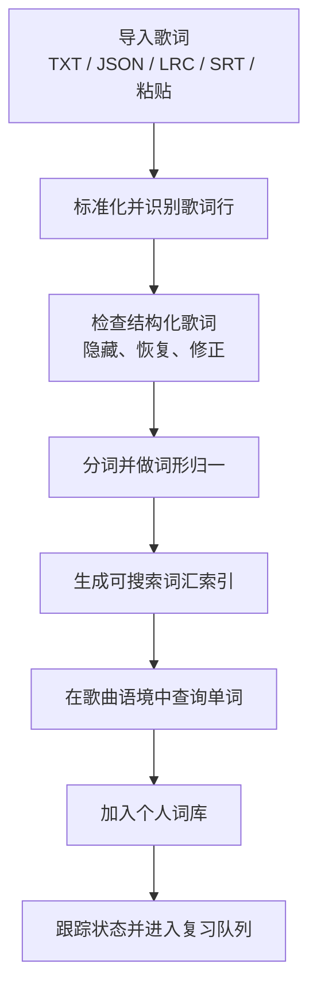
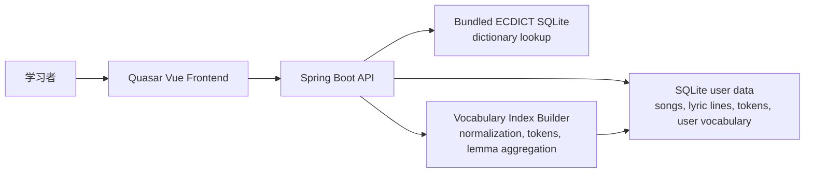

# Lyric Vocabulary Builder

[English](README.md) | [简体中文](README.zh-CN.md)

Lyric Vocabulary Builder 是一个面向中文母语者的英文歌词词汇学习应用。它不是歌词播放器，也不提供歌词库，而是把用户自己有权使用的英文歌词结构化为可查询、可追踪、可复习的个人学习材料。

项目当前聚焦一个很明确的学习闭环：导入歌词，清洗并结构化歌词，在歌词语境中查询单词，查看英英释义和中文解释，再把词加入个人词库持续复习。

## 截图


## 核心卖点

- **歌词结构化导入**：支持 TXT、JSON、LRC、SRT 和手动粘贴，围绕学习材料准备设计。
- **可恢复的清洗结果**：保留原始歌词、标准化歌词、行分类和用户修正，不做不可逆静默删除。
- **跨歌曲 lemma 搜索**：`running`、`ran`、`runs` 等词形可归并到 `run`。
- **歌词语境学习**：单词不是孤立背诵，而是在真实歌词行中出现。
- **离线词典整合**：内置 ECDICT SQLite 快照，支持英英释义和中文释义。
- **个人词库闭环**：支持加入单词、更新学习状态、记录熟悉度、查看统计和待复习词。
- **中文学习者友好**：产品文案、边缘处理和公开说明都围绕“中文用户用英文歌学英文”的定位。

## 应用流程



## 技术栈

| 层级 | 技术 |
|---|---|
| 前端 | Vue 3, Quasar 2, TypeScript, Pinia, Vue Router, Axios |
| 后端 | Java 21, Spring Boot 3.5, Spring Web, Spring Data JPA |
| 数据库 | SQLite 用户数据库 + 内置 ECDICT SQLite 词典 |
| API 契约 | OpenAPI 3.1, generated TypeScript client |
| 工具链 | Maven Wrapper, pnpm, ESLint, Vite |

## 系统架构



## 本地运行

### 后端

```powershell
cd backend
.\mvnw.cmd spring-boot:run
```

默认 API 地址：

```text
http://localhost:8080
```

开发配置使用本地 SQLite 用户数据库：

```text
backend/data/app_data.db
```

如果数据库不存在，后端会按 `schema.sql` 初始化，并执行必要的轻量迁移。

### 前端

```powershell
cd frontend
pnpm install
pnpm dev
```

Quasar 会在终端输出开发地址，通常为：

```text
http://localhost:9000
```

### 重新生成前端 API 客户端

后端 OpenAPI 契约位于：

```text
backend/src/main/resources/api-docs.yaml
```

生成客户端：

```powershell
cd frontend
pnpm gen-api
```

生成后脚本会自动适配后端 `{ code, message, data }` 响应信封。

## 验证

后端：

```powershell
cd backend
.\mvnw.cmd clean test
```

前端：

```powershell
cd frontend
pnpm lint
pnpm build
```

## 部署说明

当前项目适合本地学习工具、单机演示或小规模自托管部署。

1. 构建并运行后端：

```powershell
cd backend
.\mvnw.cmd clean package
java -jar target/backend-0.0.1-SNAPSHOT.jar
```

2. 构建前端：

```powershell
cd frontend
pnpm build
```

3. 将 `frontend/dist/spa` 作为静态站点部署，并把 API 请求转发到后端。

公开部署前建议明确配置前端 API base URL 或反向代理规则，保持 `backend/data/app_data.db` 不进入仓库，不发布用户导入的歌词或学习数据，并保留 ECDICT 来源与 MIT License 说明。

## 数据与版权边界

- 本仓库不包含、不分发歌词库。
- 用户仅应导入自己拥有使用权或有权处理的歌词文本。
- 应用会把用户导入的歌词、清洗结果、词汇索引和个人学习状态保存到本地数据库。
- 词典数据来源为 [ECDICT](https://github.com/skywind3000/ECDICT)，许可证为 MIT License。
- 应用内提供词典来源页面，便于未来公开展示时保持数据来源透明。

## 项目结构

```text
.
├── backend/                 # Spring Boot API
│   ├── src/main/java/       # domain code
│   ├── src/main/resources/  # schema, OpenAPI, dictionary resource
│   └── data/                # local runtime database, ignored by git
├── frontend/                # Quasar Vue app
│   ├── src/components/
│   ├── src/pages/
│   ├── src/services/api/    # generated OpenAPI client
│   └── src/css/             # visual tokens and global styles
├── assets/screenshots/      # README 截图
├── CHANGELOG.md             # 已完成并验证的阶段记录
└── README.md                # 默认英文 README
```

## 当前状态

Stage 0 到 Stage 7 已完成并通过验证。详情见 [CHANGELOG.md](CHANGELOG.md)。
